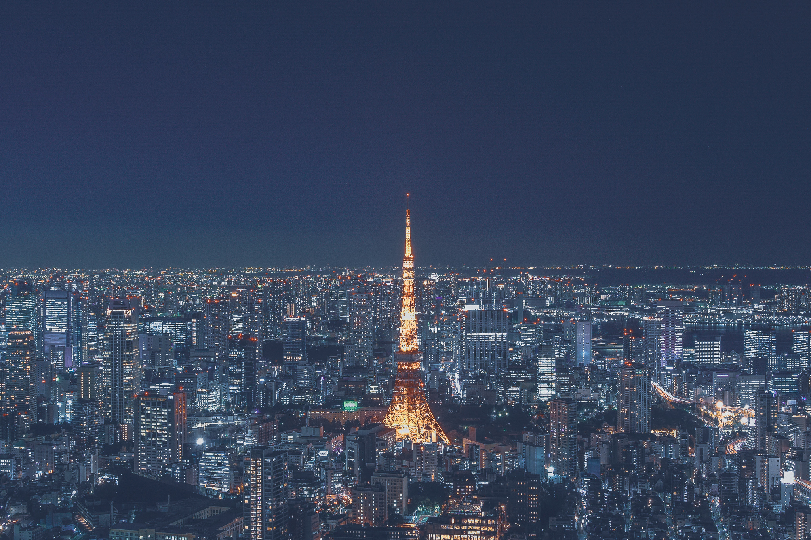

# Video Transformation
Make you favortie image peaking through the video through the color red in the video

### Usage

To use sample Video

```
python VideoTransform.py --video firework.mp4 --image tokyo_tower.jpg
```

To take input from camera, use:

```
python VideoTransform.py --image tokyo_tower.jpg

```

### Sample Result

Firework Video 🎇


Tokyo Tower Image 🗼(from my friend's photography [website](http://journeyzrz.com))



And the result? 

Output video 🔮🔮🔮


